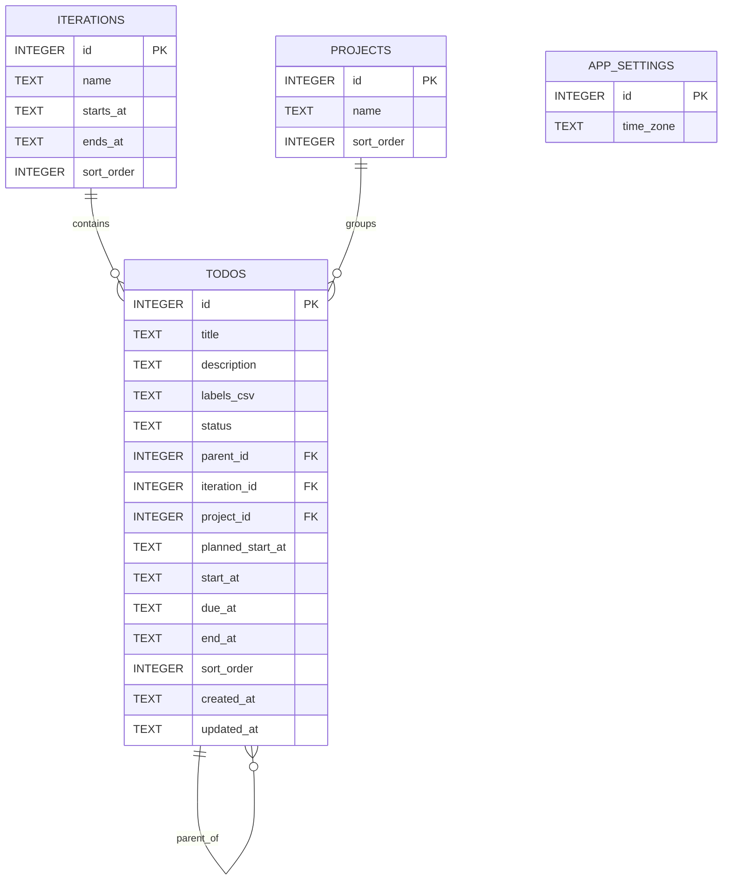
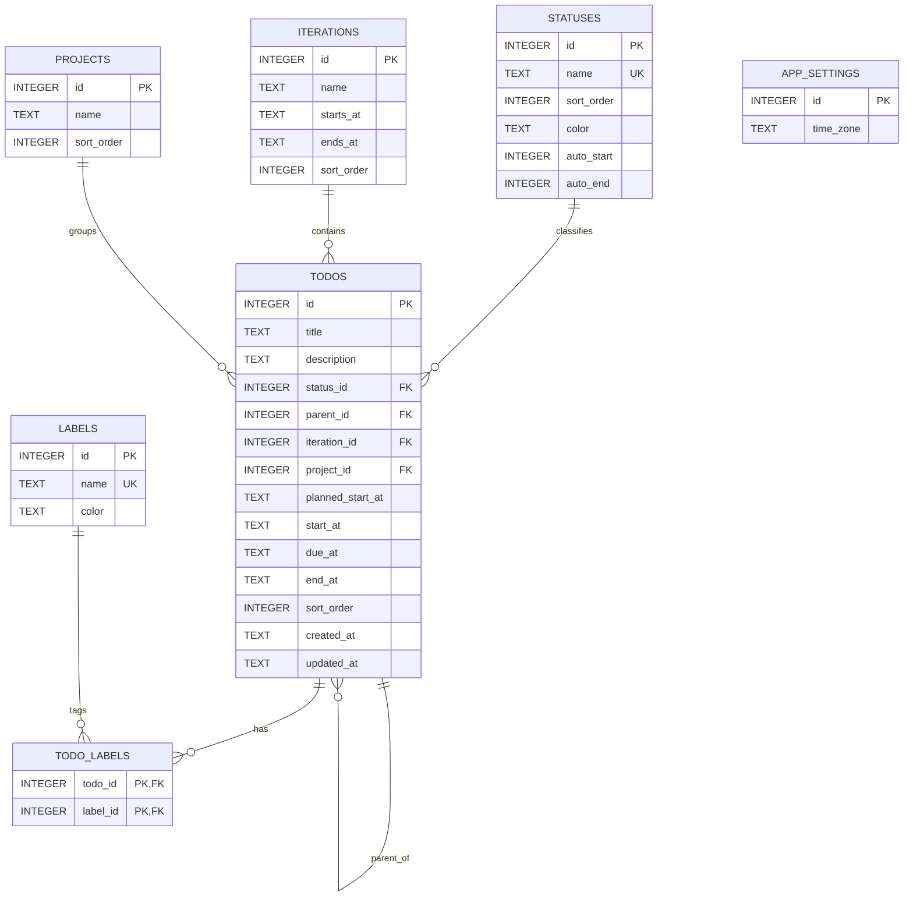
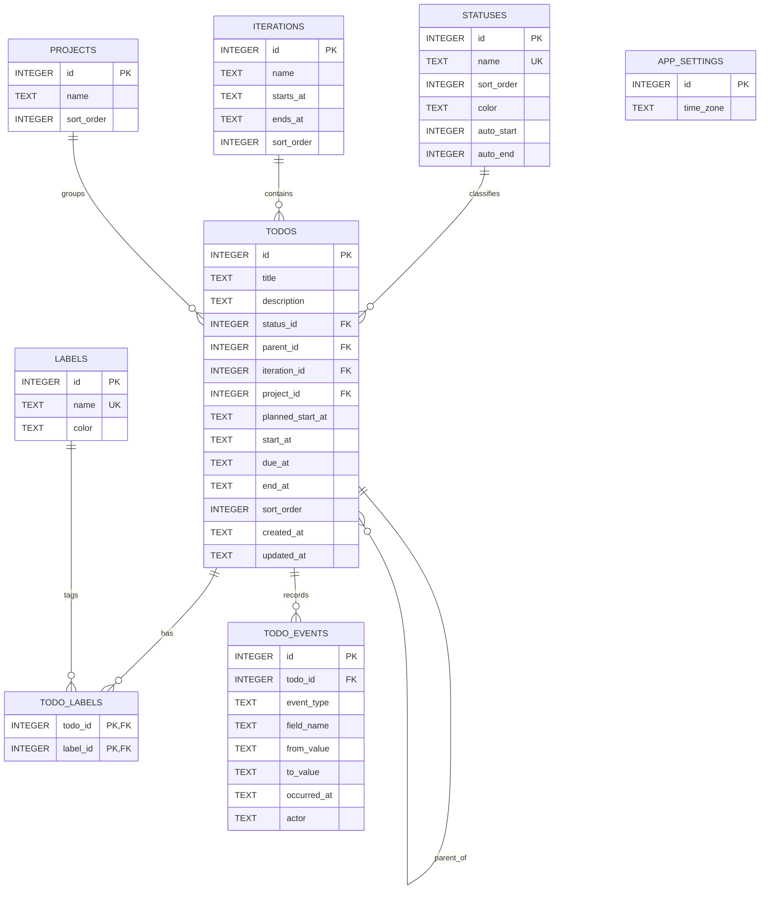

# Lesson A / B / C — データモデルと実践ガイド

このリポジトリの中心は「同じ TODO アプリの UI でも、SQLite のスキーマ（データモデル）を変えると、守れる整合性・分析可能な範囲・運用のしやすさがどう変わるか」を体験することです。

初学者向けに、次の順で読むと理解しやすいです。

1. [なぜデータモデルが重要か](#なぜデータモデルが重要か)
2. [Lesson の切り替え（必読）](#lesson-の切り替え必読)
3. [3 Lesson の対比](#3-lesson-の対比)
4. [ER 図](#er-図)
5. [各 Lesson のスキーマと設計意図](#各-lesson-のスキーマと設計意図)
6. [アプリで体験する（ハンズオン）](#アプリで体験するハンズオン)
7. [実装がどう差を吸収しているか](#実装がどう差を吸収しているか)
8. [さらに読む](#さらに読む)

---

## なぜデータモデルが重要か

アプリの画面や API は「入出力の形」を決めますが、**データベースのテーブル設計は「真実の置き場所」と「将来の問い合わせ」を決めます**。

| 観点 | フラット（Lesson A） | 正規化（Lesson B） | イベントログ（Lesson C） |
|------|----------------------|---------------------|----------------------------|
| 表記ゆれ | `status` 文字列や `labels_csv` は DB が同一性を保証しにくい | `statuses` / `labels` の名前は一意制約で揃えやすい | B と同様 |
| 多対多 | CSV は「見た目はタグ」だが DB 上は 1 列の文字列 | `todo_labels` で M:N を表現 | B と同様 |
| 集計・分析 | ラベルや状態を集計する前に、CSV や文字列を整える処理が必要 | マスタや関連テーブルを JOIN して、そのまま件数や比率を出しやすい | B の集計に加えて、変更の順番や所要時間も `todo_events` から追える |
| 機能追加・変更のしやすさ | 新しい振る舞いを足すたびに、文字列の扱いや CSV の解釈が増えやすい | マスタ列や関連テーブルを増やして、機能をデータ構造に載せやすい | B に加えて、履歴を使う分析・リプレイ機能を足しやすい |
| 履歴・監査 | 現在の `todos` 行だけを見る | 現在の `todos` とマスタだけを見る | 状態変更を `todo_events` に追記し、後から時系列で追える |

ここでいう **集計・分析** とは、たとえば「ラベル別の TODO 数」「完了率」「着手から完了までの時間」「どの順番で状態が変わったか」を調べることです。A は値が 1 列の文字列に詰まっているため前処理が増え、B はテーブルの関係を JOIN すれば集計しやすく、C はさらに履歴から時間の流れを分析できます。

「とりあえず動く」フラットから始め、**整合性と再利用のための正規化**、**監査・リプレイ・分析のためのイベント**へ段階を踏むのが、この教材のストーリーです。

---

## Lesson の切り替え（必読）

### サーバが決める「実効 Lesson」

- 環境変数 `LESSON` が `a` / `b` / `c` を決めます（未設定・不正値は **`c`**）。
- DB ファイルは `DATABASE_PATH` が無いとき、**サーバプロセスの作業ディレクトリ**を起点とした `data/app-{lesson}.db` です。Docker dev では `DATABASE_PATH=/data/app-c.db` が既定で入るため、通常は意識不要です。**Lesson を変えたら別ファイルを指す**のが安全です。
- Web 側は起動後に `GET /api/meta/lesson` を呼び、その結果を真として UI を分岐します。API が応答する前は `c` を一時表示します。

参照: [`apps/server/src/config.ts`](../apps/server/src/config.ts)、[`apps/web/src/App.tsx`](../apps/web/src/App.tsx)

### マイグレーション

`packages/db/lessons/{a|b|c}/migrations/*.sql` が昇順で適用されます。

参照: [`apps/server/src/migrate.ts`](../apps/server/src/migrate.ts)、[`packages/db/src/index.ts`](../packages/db/src/index.ts)

### Docker 開発での推奨

`docker-compose.dev.yml` では既定で `LESSON=c` と `DATABASE_PATH=/data/app-c.db` です。**Lesson を変えるときは `LESSON` と `DATABASE_PATH` をセットで変えてください**（README の例と同じ）。

```sh
# 例: Lesson A
LESSON=a DATABASE_PATH=/data/app-a.db docker compose -f docker-compose.dev.yml up --build
```

Lesson を切り替える前に `docker compose -f docker-compose.dev.yml down` してから、別の `LESSON` / `DATABASE_PATH` で起動し直すと混乱しにくいです。

- ブラウザ: **http://localhost:5173**
- API（ホスト直）: **http://localhost:3001**（既定ポート。`DEV_API_PORT` で変更可）

## 3 Lesson の対比

| 項目 | Lesson A | Lesson B | Lesson C |
|------|----------|----------|------------|
| ステータス | `todos.status`（TEXT） | `todos.status_id` → `statuses` | B と同じ |
| ラベル | `todos.labels_csv`（カンマ区切り） | `labels` + `todo_labels` | B と同じ |
| 変更履歴 | なし（現在行のみ） | なし | `todo_events`（追記） |
| Settings での Labels / Statuses マスタ編集 | **不可**（一覧は TODO 由来で合成） | 可能 | 可能 |
| Insights の replay 等 | **イベント系は空・案内** | 同左 | **利用可能** |

短いパターン要約: [`packages/db/patterns/README.md`](../packages/db/patterns/README.md)

---

## ER 図

以下は各 Lesson のマイグレーションを最後まで適用した後の概念図です。`schema_migrations` はアプリのドメインモデルではないため省略しています。

### Lesson A

Lesson A は TODO 行にステータス文字列とラベル CSV を直接持たせるフラットな形です。`projects` / `iterations` / 親 TODO への参照はありますが、ステータスやラベルのマスタはありません。



### Lesson B

Lesson B はステータスとラベルをマスタ化し、TODO とラベルの多対多を `todo_labels` で表現します。途中で追加された補助的な状態は `statuses` に統合済みで、現在の状態管理は `statuses` に一本化しています。



### Lesson C

Lesson C は Lesson B の現在状態モデルに `todo_events` を足し、変更履歴を追記していく形です。Insight の所属判定は `todo_events` ではなく、現在の `todos.iteration_id` / `todos.project_id` を JOIN して使います。



---

## 各 Lesson のスキーマと設計意図

### Lesson A — フラット（はじめの一歩）

**コア:** `iterations` と `todos`。ラベルは `labels_csv`、状態は `status` 文字列。

参照: [`packages/db/lessons/a/migrations/001_schema.sql`](../packages/db/lessons/a/migrations/001_schema.sql)

- **メリット:** テーブルが少なく、INSERT/PATCH が単純。
- **デメリット:** 「同じ意味の別表記」や「タグの重複表現」を DB だけでは防ぎにくい。ラベルに色や説明を持たせるにも不向き。

**スケジュール自動記録（トリガー）**は `status` 列の **文字列**を `LOWER` で判定しています。判定ルールが SQL に焼き付いているため、**「どの状態名で着手扱いにするか」を変えたい場合は新しいマイグレーションが必要**です（B/C は Settings のチェックひとつで挙動が変わります — §B のトリガー進化を参照）。

参照: [`packages/db/lessons/a/migrations/004_status_schedule_triggers.sql`](../packages/db/lessons/a/migrations/004_status_schedule_triggers.sql)

### Lesson B — 正規化（マスタと関連）

**コア:** `statuses`、`labels`、`todos`、`todo_labels`（TODO とラベルの M:N）。

参照: [`packages/db/lessons/b/migrations/001_schema.sql`](../packages/db/lessons/b/migrations/001_schema.sql)

- `todos.status_id` は `statuses` への **NOT NULL 外部キー** → 存在しないステータスは保存できない。
- ラベルはマスタ＋中間テーブル → **名前の一意性**や **TODO ごとのタグ集合**を素直に表現。

途中で補助的な状態テーブルが入りますが、[`006_flat_workflow_statuses.sql`](../packages/db/lessons/b/migrations/006_flat_workflow_statuses.sql) でメイン `statuses` に寄せ、[`011_drop_sub_statuses.sql`](../packages/db/lessons/b/migrations/011_drop_sub_statuses.sql) でスキーマからも削除しています（「モデルは進化する」例）。Lesson C も同じ方針で、古い状態変更イベントは `status_change` に寄せています。

**トリガーの進化:** まずステータス名で判定していたロジックを、[`009_status_schedule_trigger_settings.sql`](../packages/db/lessons/b/migrations/009_status_schedule_trigger_settings.sql) で `statuses.auto_start` / `auto_end` に寄せています。**「いつ着手・完了とみなすか」を、マイグレーションを書かずデータ（Settings）で変えられる**のがポイントです。

### Lesson C — B ＋ イベントログ（分析・リプレイ）

B と同じ OLTP に **`todo_events`** を追加します。

参照: [`packages/db/lessons/c/migrations/001_schema.sql`](../packages/db/lessons/c/migrations/001_schema.sql)

- **現在の真実**は `todos`（および関連）。**過去の事実**は `todo_events` に追記。`create` / `update`（PATCH の各フィールド変更）/ `label_add` / `label_remove` / `status_change` / `delete` などのイベントが、サーバ側の repository から積まれます（[`apps/server/src/todoRepo.ts`](../apps/server/src/todoRepo.ts)）。
- `todo_events` は `iteration_id` / `project_id` を持ちません。Insight は `todo_events.todo_id` から `todos` に JOIN し、現在の所属で絞り込みます。TODO の所属を後で変えた場合、過去イベントも現在の所属側に表示されます。
- `todo_events.todo_id` は `ON DELETE SET NULL` 参照なので、**TODO を物理削除しても履歴行は残ります**。ただし所属別 Insight は現在の `todos` を基準にするため、削除済み TODO のイベントは所属フィルタの対象外です。
- [`013_drop_todo_event_scope_columns.sql`](../packages/db/lessons/c/migrations/013_drop_todo_event_scope_columns.sql) で、以前の `todo_events.iteration_id` / `project_id` スナップショット列を削除しています。
- イベント行の `actor` 列は環境変数 `ACTOR` を入れています（[`apps/server/src/todoRepo.ts`](../apps/server/src/todoRepo.ts)）。`docker-compose.dev.yml` では `ACTOR: docker-dev` が既定値で、replay の見え方を変えて遊べます。

---

## アプリで体験する（ハンズオン）

以下は **各 Lesson ごとに同じ操作を繰り返す**想定です。差が体感として分かります。

### 0. 共通準備

1. リポジトリルートで Docker を起動（例は Lesson A）。

   ```sh
   LESSON=a DATABASE_PATH=/data/app-a.db docker compose -f docker-compose.dev.yml up --build
   ```

2. ブラウザで **http://localhost:5173** を開く。
3. （任意）シードを入れてサンプルデータを見る。起動した Lesson と同じ `LESSON` / `DATABASE_PATH` を `run` 側にも指定してください。

   ```sh
   # Lesson A
   LESSON=a DATABASE_PATH=/data/app-a.db docker compose -f docker-compose.dev.yml run --rm --entrypoint bun dev run --cwd apps/server scripts/seed.ts

   # Lesson B
   LESSON=b DATABASE_PATH=/data/app-b.db docker compose -f docker-compose.dev.yml run --rm --entrypoint bun dev run --cwd apps/server scripts/seed.ts

   # Lesson C
   LESSON=c DATABASE_PATH=/data/app-c.db docker compose -f docker-compose.dev.yml run --rm --entrypoint bun dev run --cwd apps/server scripts/seed.ts
   ```

4. **Settings** を開き、画面上部付近の **Lesson** 表示が意図した `A` / `B` / `C` になっていることを確認する。

### 1. Kanban — ステータスと D&D

1. **Kanban** で「TODO を追加」をクリック。
2. サイドパネルでタイトルを入力して作成。

**Lesson A**

- カンバンの列キーは **ステータス名（文字列）**。ドラッグ＆ドロップ後、API は `{ status: "<列名>" }` の PATCH になります（[`KanbanPage.tsx`](../apps/web/src/pages/KanbanPage.tsx)）。
- パネルでは **ステータスが自由入力の TextInput**、`labels_csv` が **カンマ区切りの TextInput** です（[`TodoSidePanel.tsx`](../apps/web/src/ui/TodoSidePanel.tsx)）。

**Lesson B / C**

- 列キーは **`status.id`（数値）**。D&D は `{ statusId: <数値> }` の PATCH。
- ラベルは **マスタから MultiSelect**。

3. 作成したカードを **doing** 列へドラッグし、その後 **done** 列へ。`start_at` / `end_at` が埋まるか Settings のステータス設定（B/C の `auto_start` / `auto_end`）や DB トリガーと対応させて観察してください。

### 2. Settings — マスタ CRUD の有無

1. **Settings** → **Labels** / **Statuses**。

**Lesson A**

- 「Lesson A では `labels_csv` / 文字列ステータス」という **説明のみ**。CRUD はできません（DBに `labels` / `statuses` テーブルがないため）。
- ただし一覧 API は空ではありません。既存 TODO の `labels_csv` や `status` から、画面表示用のラベル・ステータス一覧をサーバが合成します。

**Lesson B / C**

- ラベル・ステータスを追加・色変更・自動日時フラグ（`start_at` / `end_at`）を触れる。これが **正規化マスタの運用**です。

**おすすめ実験（A vs B/C）**

同じ操作で結果が変わることを体感する小実験です。

1. Lesson A で TODO のサイドパネルから `labels_csv` に `docs, Docs, doc` と入力して保存。`Settings` の Labels 一覧は TODO の CSV から合成されるため、**3 件とも別々のラベル**として並びます（`labelRepo.ts` は `split(",")` → `trim()` → `Set` 重複除去で大文字小文字は区別）。
2. 同じ Lesson B/C で `Settings` から `docs` ラベルを 2 回作ろうとする。2 回目は `labels.name` の `UNIQUE` 制約で **作成に失敗**する。
3. Lesson B/C で `docs` ラベルを TODO に紐付けたあと、`Settings` から削除すると、`todo_labels` の `ON DELETE CASCADE` で **TODO 側の付与も同時に消える**ことを確認する（A は文字列なので「ラベルを削除する」概念自体がない）。

### 3. Insights — 集計とイベント

1. **Insights** を開く。
2. イテレーションを選び、トレンド・ラベル件数・完了時間などを見る。

**Lesson A**

- サーバ側 SQL が `labels_csv` や `t.status` を使う分岐になります（[`insights.ts`](../apps/server/src/insights.ts)）。

**Lesson B**

- JOIN ベースの集計が中心。イベント系 API は **C 専用**のため結果が空や案内になります。

**Lesson C**

- **replay（時系列イベント）** やチケット単位の探索が有効です。TODO を PATCH するたびに [`todoRepo.ts`](../apps/server/src/todoRepo.ts) が `todo_events` へ追記します。

**おすすめ実験（C）**

1. Kanban またはパネルで、タイトル・ステータス・ラベル・プロジェクトを数回変更する。
2. Insights の replay / イベント要約を見て、**同じ操作がイベント行として積み上がる**ことを確認する。

---

## 実装がどう差を吸収しているか

同じ REST っぽい API のまま、サーバの repository で lesson を分岐しています。

| 関心 | 主なファイル |
|------|----------------|
| TODO 一覧の形 | [`apps/server/src/todoRepo.ts`](../apps/server/src/todoRepo.ts)（A は `labels_csv` を split して擬似 `labels` 配列、B/C は JOIN） |
| ステータス一覧 | [`apps/server/src/statusRepo.ts`](../apps/server/src/statusRepo.ts)（A は既存 TODO の DISTINCT + 既定名、B/C は `statuses` テーブル） |
| ラベル一覧 | [`apps/server/src/labelRepo.ts`](../apps/server/src/labelRepo.ts)（A は CSV から名前抽出） |
| イベント追記 | [`apps/server/src/todoRepo.ts`](../apps/server/src/todoRepo.ts)（**lesson === `"c"`** のときのみ `INSERT INTO todo_events`） |
| TODO 編集パネルの入力 UI | [`apps/web/src/ui/TodoSidePanel.tsx`](../apps/web/src/ui/TodoSidePanel.tsx)（A: `status` TextInput / `labels_csv` TextInput、B/C: `Select` / `MultiSelect`） |
| 画面の lesson 表示・分岐 | [`apps/web/src/pages/KanbanPage.tsx`](../apps/web/src/pages/KanbanPage.tsx)、[`SettingsPage.tsx`](../apps/web/src/pages/SettingsPage.tsx)、[`InsightsPage.tsx`](../apps/web/src/pages/InsightsPage.tsx) |

これは教材として重要なパターンです。**UI を固定し、データ層だけ差し替える**ことで、「モデル変更の影響範囲」を議論しやすくしています。

---

## さらに読む

- ルート README（Docker・シード・API 概要）: [`README.md`](../README.md)
- DuckDB 向けサンプル SQL: [`packages/db/patterns/insights_duckdb.sql`](../packages/db/patterns/insights_duckdb.sql)
  - 既定では Insights は SQLite で集計しますが、`INSIGHTS_ENGINE=duckdb_cli` を指定し `duckdb` CLI が PATH にあると、**同じクエリを DuckDB に切り替えて実行**できます（`sqlite_attach` 経由 / [`apps/server/src/insights.ts`](../apps/server/src/insights.ts)）。
- マイグレーション一覧: [`packages/db/lessons/a/migrations/`](../packages/db/lessons/a/migrations/)、[`b/`](../packages/db/lessons/b/migrations/)、[`c/`](../packages/db/lessons/c/migrations/)

---

## まとめ

- **Lesson A** は学習コストが低いが、DB が表記ゆれや分析の負債を止めにくい。
- **Lesson B** はマスタと関連で **整合性と運用**に強い。
- **Lesson C** は **現在＋履歴** の二層で、分析・監査・リプレイに踏み込める。

このドキュメントを軸に、`migrations` とアプリを行き来しながら読むと、データモデリングがプロダクトに与える影響が腹落ちしやすくなります。
